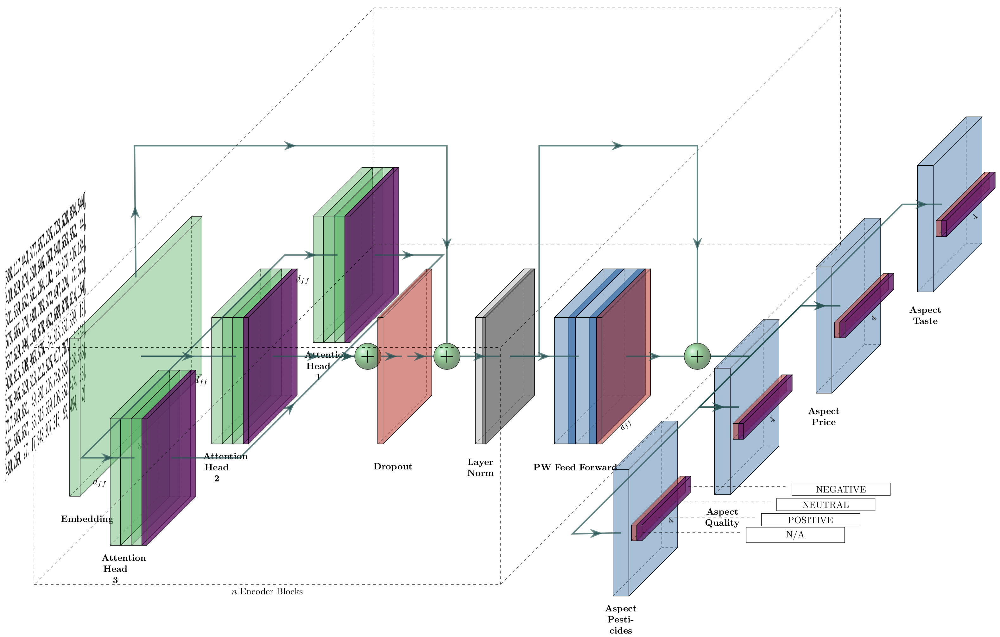

# ABSA-Transformer


This is the repository for my NLP master thesis with the title **Transfer and Multitask Learning for Aspect-Based Sentiment Analysis Using the Google Transformer Architecture**.

It is based on the Google Transformer architecture, and the paper *Attention is all you need* (https://arxiv.org/abs/1706.03762)

I recommend to check out the excellent [Annotated Transformer](http://nlp.seas.harvard.edu/2018/04/03/attention.html) guide from Harvard or the [Illustrated Transformer](http://jalammar.github.io/illustrated-transformer/) by Jay Alammar. Both are excellent resources on the topic.

# Thesis

The full thesis document is located under [/Thesis/050619_Final.pdf](/Thesis/050619_Final.pdf). For the presentation slides go to [/Thesis/00_FinalPresentation.pptx](/Thesis/00_FinalPresentation.pptx).

## Abstract

In this master’s thesis, we propose a novel neural network architecture for Aspect Based Sentiment Analysis (ABSA). This architecture is based on the Google transformer introduced in 2017 by Vaswani et al. [80] and inspired by the works of Schmitt et al. [69].

The model we propose classifies multi-label aspect-based sentiment end-to-end. To the best of our knowledge, this is the first model which uses a transformer for aspect-based sentiment analysis.

Furthermore, this thesis explores transfer- and multitask learning. We show that multitask learning is capable of augmenting data with auxiliary tasks, thereby boosting model performance.

For the evaluation of transfer learning, we reduce and categorize a collection of 18 million Amazon reviews. From this data, we form a new, large scale topic-based amazon review dataset with almost 1.2 million reviews. We use this dataset to trans- fer knowledge to a much smaller organic dataset. We demonstrate that we achieve significant performance increases using this technique.


Finally, we evaluate and benchmark our proposed architecture on four datasets and report that the proposed ABSA-Transformer (ABSA-T) model achieves very competitive results on all datasets.

## Data

This application provides data loaders for the following datasets:

- GermEval-2017
- CoNLL-2003
- Organic-2019
- Custom Amazon Reviews

### GermEval-2017

The data for GermEval-2017 can be downloaded directly from the project website. To be able to train on this data, make sure to correct a spelling mistake in one of the data splits. There is one label which is spelled incorrectly. Instead of `postive` it should be `positive`.

Put the data into `data/data/germeval-2017`.

### CoNLL-2003

The data from the project website can be used directly without changes.

Put the data into `data/data/conll2003`

### Organic-2019

To get the data please send a mail to the socialROM team @ TUM.

Put the data into `data/data/organic2019`


### Custom Amazon Reviews

I will make the data available for download in the future. In the meantime just contact me.

If you have the data place it in `data/data/amazon/splits`


## Word Vectors

The application should automatically download missing word vectors into `.vector_cache`. However, sometimes connection problems may prevent this. In this case, place the manually downloaded vector files into the `.vector_cache` folder. The file should either be a `.txt` file for GloVe vectors or a `.vec` file for fastText vectors.

## Run Code

The first step to run this code is to clone the repository using `git clone `

### Docker

I created a Docker image you can use to run the code inside a Docker container. The Docker image is based on https://github.com/anibali/docker-pytorch and runs on CUDA 8.0

#### CUDA
The image is based on https://github.com/anibali/docker-pytorch. In order to run it with CUDA support you need to install the latest NVIDIA drivers and libraries as well as CUDA.

You also need to install the NVIDIA Docker runtime which you can find here: https://github.com/NVIDIA/nvidia-docker

#### Run prebuild image from DockerHub (recommended)
To run this image you have to login to the DockerHub with `docker login`. To create a Docker account head over to https://cloud.docker.com

This repository can also be obtained prebuild from the DockerHub. For now, the repository is private. Once authenticated the image can be run via

```
docker run -it --rm --init \
	-p 8888:8888 \
	--runtime=nvidia \
	--volume=$(pwd):/app \
	--name=absa
	jorba/absa-transformer:latest
```

Use this one-liner for easy copy and pasting: 

`docker run -it --rm --init -p 8888:8888 --runtime=nvidia --volume=$(pwd):/app --name=absa jorba/absa-transformer:latest`

The commands above starts the container in interactive mode which means that as soon as you close your session, the container stops. You probably don't want this behavior when running long experiments. To run the container in detached mode, use this command:

`docker run -d -p 8888:8888 --rm --runtime=nvidia --volume=$(pwd):/app --name=absa jorba/absa-transformer:latest`

To get the token of the notebook, use `docker logs absa`.

#### Upgrade image from DockerHub
The Docker runtime always tries to run the local version of the image instead of pulling a new one from the Docker hub even when including the tag `:latest`. To upgrade a container, run the following commands:

```
docker pull jorba/absa-transformer:latest
docker stop absa
docker rm absa
docker run -it --init -p 8888:8888 --runtime=nvidia --volume=$(pwd):/app --name=absa jorba/absa-transformer:latest
```

#### Manual build with Dockerfile

To build the Docker image, navigate to the repository folder which contains the `Dockerfile`.

Next, run the Docker build command:

```
docker build .
```

Make sure you include the `.` at the end of the command to specify that Docker should search for the `Dockerfile` in the current directory.

Note down the Docker image id which should have a format like `3624c152fb28`.

##### Run manual build

To run the image simply run this command in the terminal. (Replace `image:version` with your imageId. You can also get this id by running the command `docker images`)

It creates a container and start the jupyter notebook server which you can access at http://localhost:8888
```
docker run -it --init --rm \
	-p 8888:8888 \
	--runtime=nvidia \
	--name=absa \
	--volume=$(pwd):/app \
	image:version
```

For the windows command line (not powershell), use `%cd%` instead to mount the current directory as a volume so that the run command looks like this:

```
docker run -it --init --rm \
	-p 8888:8888 \
	--runtime=nvidia \
	--name=absa \
	--volume=%cd%:/app \
	image:version
```

### Connect to remote Notebook

Connecting to a notebook running on a remote machine is easy. Just run this command on your local machine. This opens an SSH-tunnel to the remote machine and maps the jupyter-ports 8888 to your local machines 8888 port. Make sure a local notebook does not occupy this port.

`ssh -N -L 8080:localhost:8080 yourname@remoteServer.com`

If you don't have an SSH key, this will ask for your password. After that don't expect any further output. It should still work. Just try to access the notebook on your local machine at http://localhost:8888 

There is one caveat regarding jupyter notebooks though. The browser tab on your local machine has to remain open the whole time. Once you lose connection or close the tab, the script does not stop but you will not get any further output.

If you do not have a local machine which runs 24/7 you can also use a VM which keeps the notebook open.

### Run code with CMD

It is also possible to run the `main.py` file. This file can be used for model training and evaluation.

The following parameters can be used:

#### Dataset (required)

**This parameter is required.**

The dataset parameter specifies the dataset which should be used for training possible choices are:
- `germeval`: Use the GermEval-2017 dataset for training
- `organic`: Use the organic dataset for training (make sure to add the task to specify the data split)
- `coNLL-2003`: Use the CoNLL-2003 NER dataset.
- `amazon`: Use the custom amazon dataset for category-sentiment analysis
- `transfer-amazon-organic`: Train on the amazon dataset and transfer the knowledge to the organic-coarse dataset.


#### Cuda

This parameter overwrites the default CUDA detection. If it is omitted CUDA will be used if it is available. If not it will be turned off.

To turn CUDA off use

`main.py germeval --cuda=False`


#### Runs

This number specifies the number of times a experiment is repeated. The default parameter value is 1.

This parameter can be used like this

`main.py germeval --runs=5`

#### Epochs

Specifies the maximum number of epochs to train. Since this package uses early stopping it is save to put a very high number here (default: 35) since the training will stop anyway if the model does not improve.

This parameter can be used like this

`main.py germeval --epochs=35`


#### Name

This parameter let's the user specify a name for the experiment. All logs and files can be found at the path `logs/EXPERIMENT_NAME/DATE/EXP_NUM/` where `DATE` is the current date and `EXP_NUM` is a sequential number when performing multiple experiments (or runs) under the same name at the same date.

The command 

`main.py germeval --name=GermEval-Glove`

would train a model with the logs at `logs/GermEval-Glove/20190527/1`.

If tensorboard is enabled this will also set the name for the model in tensorboard.

#### Description

Adds a short description for the log files.


#### Task

This parameter is important for some datasets since it specifies which task should be performed.


##### Organic Dataset

For the organic dataset this parameter specifies which data split should be used as well as the sentence combination selection.

Possible values are:

- `all`: All entity-attribute combinations + sentiment
- `entities`: Only entities + sentiment
- `attributes`: Only attributes + sentiment
- `coarse`: Coarse data split + sentiment

For the sentence combination technique, add a `_combine` to the task (e.g. `coarse_combine`)


##### GermEval Dataset

In case of the GermEval dataset the task parameter specifies whether or not to use multitask training. Use `germeval` for normal training and `germeval_multitask` for multitask training.

A possible example which would train a model on the GermEval dataset with multitask training would be

`main.py germeval --task=germeval_multitask`


#### Random

If this parameter is set to true (`main.py --random=True`) a random classifier will be used for one epoch.

#### Restore Model

Provide a path to a checkpoint-folder which contains checkpoints. The application will search for the checkpoint with the highest score and load the weights. Make sure that all hyperparameters are the same.

Due to CUDA restrictions of pytorch it is currently not possible to load a GPU model in a CPU environment. 

Example:

`main.py germeval --task=germeval --restoreModel=/logs/test/0/checkpoints`


Currently, this parameter is only implemented for the transfer learning task. Using this parameter will load the source model which will be used for the knowledge transfer. For the other tasks the api can be used. The `Trainer` class provides the method `load_model(self, file_name=None, custom_path=None)`. Use `custom_path` to specify the folder which contains the checkpoint file.


#### Transfer Learning: Produce Baseline

This parameter is a special parameter which produces the baseline model for the transfer learning task. This is a model with the same vocabulary size restriction as the normal transfer learning task. However, when this parameter is true, the knowledge transfer step will not be performed.

This flag is set to true like this:

`main.py transfer-amazon-organic --produceBaseline=True`
